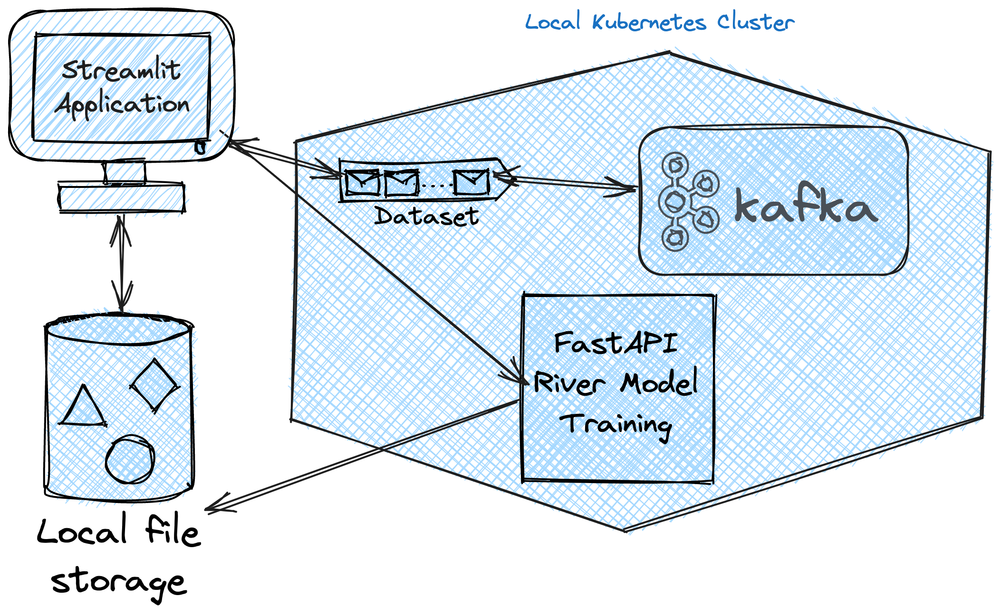

# Event Driven Machine Learning Demo
This is a demo of an event driven machine learning application. The application allows a user to simulate data based on a linear regression model, send the data to a Kafka topic, and then use the data to train a linear regression model with the River package.



## Getting Started
### Prerequisites
* Python 3.8 or higher
* Poetry
* Docker
* Minikube
* Kubectl

### Installing
1. Clone the repository
2. Install dependencies
```bash
poetry install
```
3. Start minikube
```bash
minikube start --driver=docker
```
4. Deploy Zookeeper
```bash
kubectl apply -f kafka_kubernetes/namespace.yaml
kubectl apply -f kafka_kubernetes/zookeeper.yaml
```
5. Once the zookeeper pods are running, update the kafka_kubernetes/kafka.yaml file with the IP address of the zookeeper pods. Then deploy the kafka pods.
```bash
kubectl get pods -A -o wide | grep 'zookeeper'
# Update the kafka.yaml file with the IP address of the zookeeper pods
kubectl apply -f kafka_kubernetes/kafka.yaml
```
6. Port forward the Kafka pod to the local machine (keep the terminal open)
```bash
kubectl port-forward <YOUR-KAFKA-BROKER-POD-NAME-HERE> 9092:9092 -n kafka
```
7. Mount the minikube virtual machine to the local file system (keep the terminal open)
```bash
minikube mount /Users:/Users
```
8. Build and push the FastAPI image to your docker registry
```bash
docker build -t <your_docker_registry>/online_learner:latest .
docker push <your_docker_registry>/online_learner:latest
```
9. Update the FastAPI deployment file with the new image tag
10. Deploy the FastAPI application
```bash
kubectl apply -f online_learner_app/deployment.yaml
```
11. Use minikube to run the fastapi service(keep the terminal open)
```bash
minikube service fast-api-service
```
12. In the streamlit_app.py file, update the IP address of the fastapi service
13. Run the streamlit application(keep the terminal open)
```bash
streamlit run streamlit_app.py
```

